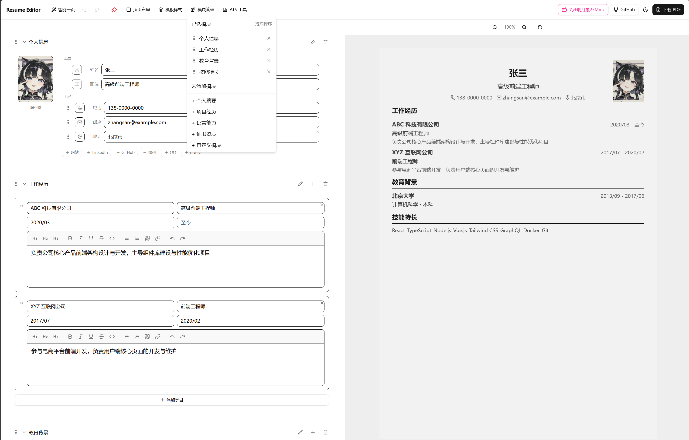

# zsk-resume

一款基于 React + TypeScript + Vite 构建的现代化在线简历编辑器，支持实时预览、拖拽排序、多模板切换、PDF 导出等功能。



## 技术栈

| 类别 | 技术 |
|------|------|
| 框架 | React 19 + TypeScript |
| 构建工具 | Vite 8 |
| 样式 | Tailwind CSS 4 + Radix UI |
| 状态管理 | Zustand 5 |
| 富文本编辑 | TipTap 3 |
| 拖拽排序 | @dnd-kit |
| PDF 导出 | html2canvas + jsPDF |
| UI 组件 | shadcn/ui |

## 功能特性

- 实时预览：左侧编辑，右侧实时预览 A4 简历效果
- 拖拽排序：支持简历模块的拖拽排序
- 多模板切换：经典单栏、现代双栏、极简黑白、紧凑高效、时间线风格
- 富文本编辑：工作经历、项目描述支持富文本编辑
- 智能一页：自动调整字体和间距，确保内容在一页内
- PDF 导出：基于 html2canvas 将预览转为高清 PDF
- 响应式设计：支持移动端编辑/预览切换
- 本地存储：自动保存简历数据到本地
- Cookie 合规：支持用户同意管理

## 项目结构

```
src/
├── components/
│   ├── consent/          # Cookie 同意弹窗
│   ├── editor/           # 编辑器组件
│   │   ├── BlockEditor.tsx         # 模块编辑器
│   │   ├── SortableBlockEditor.tsx # 可拖拽模块
│   │   ├── TiptapEditor.tsx        # 富文本编辑器
│   │   ├── PhotoUploader.tsx       # 照片上传
│   │   └── FieldIconPicker.tsx     # 图标选择器
│   ├── layout/           # 布局组件
│   │   ├── TopToolbar.tsx          # 顶部工具栏
│   │   └── EditorPanel.tsx         # 编辑面板
│   ├── preview/          # 预览组件
│   │   ├── ResumePreview.tsx       # 简历预览
│   │   └── IconRenderer.tsx        # 图标渲染
│   ├── pdf/              # PDF 组件
│   │   └── ResumePDFDocument.tsx   # PDF 文档
│   ├── toolbar/          # 工具栏组件
│   │   ├── DownloadPDFButton.tsx   # PDF 下载
│   │   ├── PageLayoutDropdown.tsx  # 页面布局
│   │   ├── ThemeToggle.tsx         # 主题切换
│   │   └── BlockManagerDropdown.tsx# 模块管理
│   └── ui/               # shadcn/ui 组件
├── hooks/                # 自定义 Hooks
│   ├── usePagination.ts            # 分页逻辑
│   ├── useZoom.ts                  # 缩放控制
│   ├── usePan.ts                   # 拖拽平移
│   └── useMediaQuery.ts            # 响应式查询
├── lib/                  # 工具库
│   ├── templates.ts                # 模板配置
│   ├── pagination.ts               # 分页计算
│   ├── wordParser.ts               # Word 导入解析
│   └── utils.ts                    # 通用工具
├── store/                # 状态管理
│   ├── resumeStore.ts              # 简历状态
│   └── consentStore.ts             # 同意状态
├── types/                # TypeScript 类型
│   └── resume.ts                   # 简历类型定义
├── App.tsx               # 根组件
├── main.tsx              # 入口文件
└── index.css             # 全局样式
```

## 快速开始

```bash
# 安装依赖
npm install

# 启动开发服务器
npm run dev

# 构建生产版本
npm run build

# 预览生产构建
npm run preview

# 代码检查
npm run lint
```

## 核心依赖

### 生产依赖

| 包名 | 版本 | 说明 |
|------|------|------|
| react | ^19.2.5 | UI 框架 |
| react-dom | ^19.2.5 | React DOM |
| typescript | ~6.0.2 | 类型系统 |
| vite | ^8.0.10 | 构建工具 |
| tailwindcss | ^4.1.6 | 原子化 CSS |
| zustand | ^5.0.5 | 状态管理 |
| @tiptap/react | ^3.22.4 | 富文本编辑器 |
| @tiptap/starter-kit | ^3.22.4 | TipTap 基础扩展 |
| @dnd-kit/core | ^6.3.1 | 拖拽核心 |
| @dnd-kit/sortable | ^10.0.0 | 排序拖拽 |
| html2canvas | ^1.4.1 | DOM 转 Canvas |
| jspdf | ^4.2.1 | PDF 生成 |
| lucide-react | ^0.488.0 | 图标库 |
| radix-ui | ^1.4.3 | 无头 UI 组件 |
| class-variance-authority | ^0.7.1 | 组件变体管理 |
| clsx | ^2.1.1 | 类名合并 |
| tailwind-merge | ^3.0.2 | Tailwind 类名合并 |

### 开发依赖

| 包名 | 版本 | 说明 |
|------|------|------|
| @vitejs/plugin-react | ^6.0.1 | Vite React 插件 |
| @tailwindcss/vite | ^4.1.6 | Tailwind Vite 插件 |
| eslint | ^10.2.1 | 代码检查 |
| typescript-eslint | ^8.58.2 | TypeScript ESLint |

## 开发脚本

| 脚本 | 命令 | 说明 |
|------|------|------|
| dev | `vite` | 启动开发服务器 |
| build | `tsc -b && vite build` | 类型检查并构建 |
| lint | `eslint .` | 运行 ESLint 检查 |
| preview | `vite preview` | 预览生产构建 |

## 模板配置

项目内置 5 种简历模板，每种模板包含独立的配色方案、字体、间距和标题样式：

| 模板 | 风格 | 适用场景 |
|------|------|----------|
| 经典单栏 | 传统居中，下划线标题 | 传统行业、应届生 |
| 现代双栏 | 左侧信息，右侧内容 | 互联网、技术岗 |
| 极简黑白 | 大量留白，线条分隔 | 设计、创意行业 |
| 紧凑高效 | 最大信息密度 | 经验丰富者 |
| 时间线风格 | 时间轴竖线 | 连续职业路径 |

## 许可证

MIT
